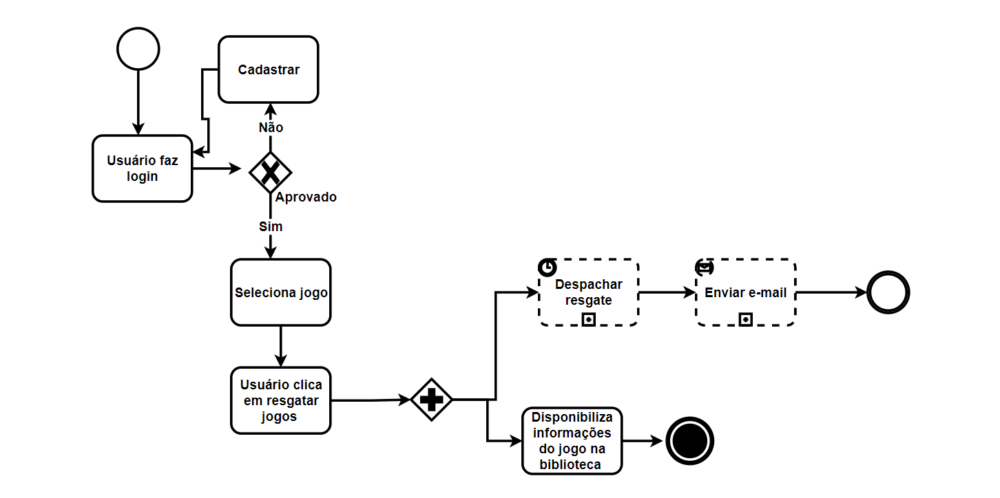
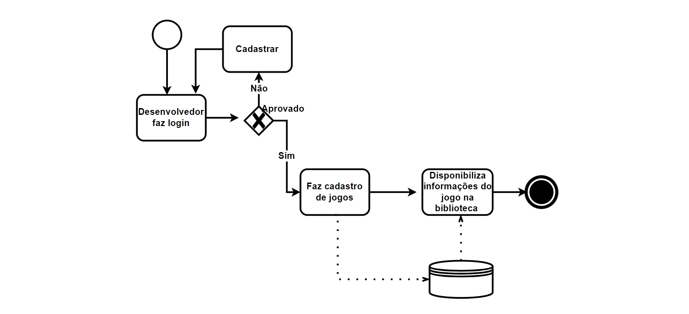
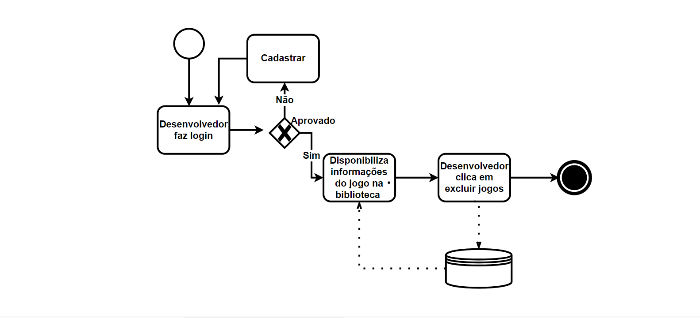
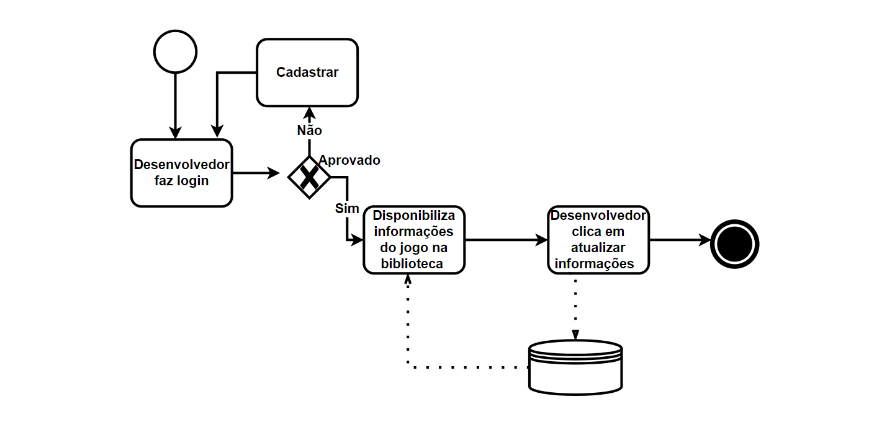
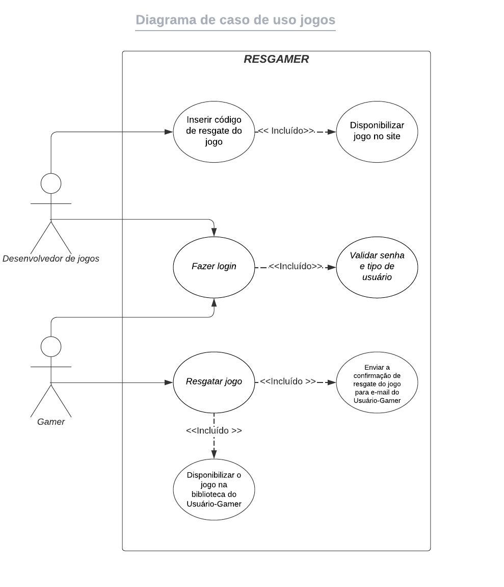
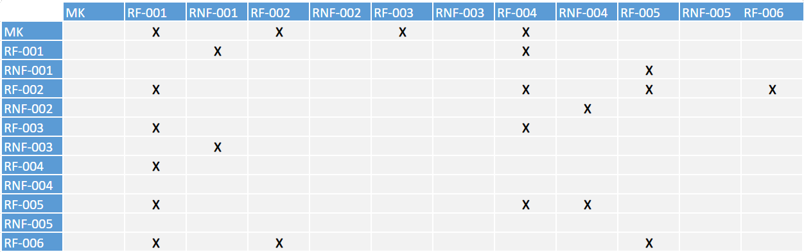
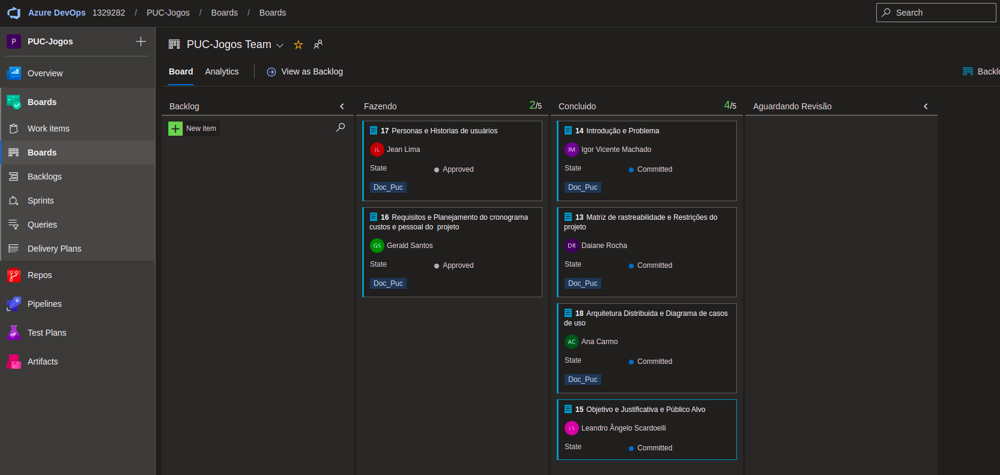
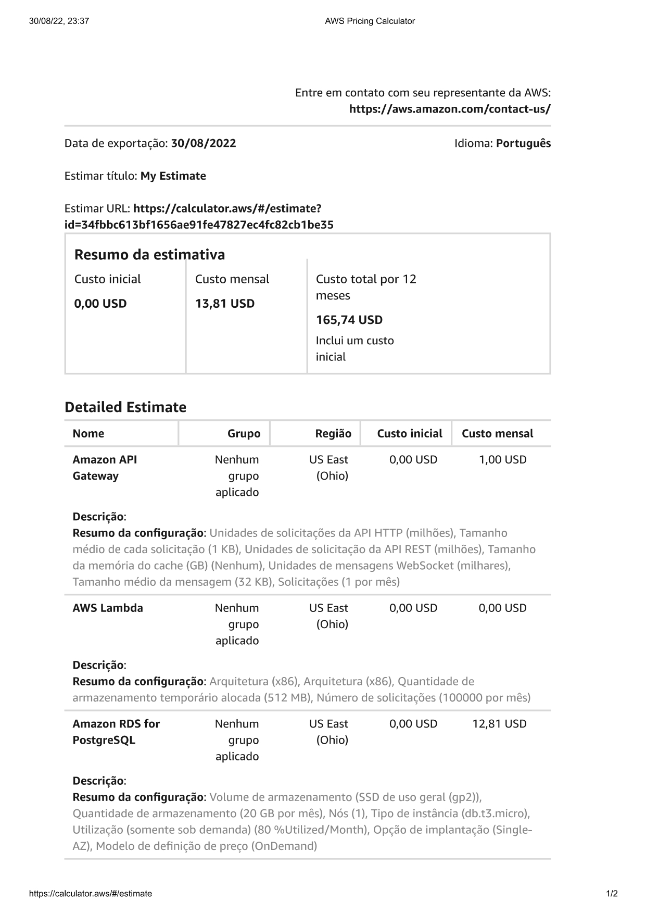

# Especificações do Projeto

Esse projeto tem como intenção o desenvolvimento dessa aplicação focando na necessidade de uma ferramenta que facilite a disponibilidade de jogos para os desenvolvedores de jogos e o acesso a jogos para os gamers. Pensando nisso, foram criadas as seguintes personas e histórias de usuário para colaborar com o escopo deste projeto.

## Personas

NOME | PROFISSÃO E IDADE | MOTIVAÇÕES | FRUSTRAÇÕES | HOBBIES, HISTÓRIA| APLICATIVOS, SITES |
|----|----|----|----|----|----|
Carlos Henrique | - Estudante   - 16 anos | - Está buscando uma plataforma que forneça jogos grátis. | - Está tentando conseguir uma oportunidade de menor aprendiz faz algum tempo e não obteve sucesso. | - Gosta de jogar videogame   - Viajar   - Não consegue comprar jogos com frequência | - Instagram   - Twitter   - Facebook   - Twitch |
Rogério Guimarães | - Gerente de loja de calçados   - 32 anos | - Quer colecionar jogos na versão digital   - Gostaria de uma ferramenta que possa organizar e encontrar seu jogos facilmente. | - Tem dificuldades de catalogar e organizar seus jogos.   -  Está ficando sem espaço físico para guardar sua coleção. | - Coleciona jogos antigos   - Seu video game preferido é o Nintendo 64   - Adora andar de bicicleta | - Instagram   - LinkedIn   - Facebook |
Elaine Resende | - Desenvolvedora de jogos   - 27 anos | - Busca uma plataforma para disponibilizar seus jogos.   - Está disposta a fornecer chaves gratuitas desses jogos para divulgação. | - A pouca quantidade de mulheres no cenário competitivo de jogos. | - Seu primeiro contato com jogos foi aos 4 anos de idade.   - Já foi jogadora profissional de League of Legends. | - Facebook   - LinkedIn   - Twitch|
Fernanda Souza | - Corretora de imóveis   - 38 anos | - Busca uma plataforma que forneça diferentes jogos para descobrir o seu estilo preferido. | - Tentou jogar alguns jogos,  porém eles eram difíceis.  - Não gostou de jogos online, pois os outros jogadores foram desrespeitosos. | - Começou a jogar em 2020.   - Seu jogo preferido é Among Us.   - Joga vôlei aos fins de semana. | - Facebook   - LinkedIn   - Twitter |

## Histórias de Usuários

Com base na análise das personas forma identificadas as seguintes histórias de usuários:

|EU COMO... `PERSONA`| QUERO/PRECISO ... `FUNCIONALIDADE` |PARA ... `MOTIVO/VALOR`                 |
|--------------------|------------------------------------|----------------------------------------|
|Carlos Henrique  | Resgatar jogos grátis           | Jogar grandes títulos sem gastar dinheiro, pois não tem emprego.               |
|Rogério Guimarães       | Visualizar quantos e quais jogos possui.                  | Saber a situação de sua coleção.  |
|Rogério Guimarães       | Organizar e encontrar os jogos rapidamente.                 | Poder jogar um jogo específico rapidamente. |
|Elaine Resende       | Cadastrar jogos na plataforma.                 | Poder vender esses jogos para os usuários. |
|Fernada Souza       | Receber recomendações de jogos.                 | Encontrar jogos que sejam relacionados ao seu gosto pessoal. |

## Modelagem do Processo de Negócio 

### Análise da Situação Atual

O problema que se busca solucionar ao desenvolver este sistema é o tempo gasto para localizar e adquirir jogos, que correspondam ao perfil do usuário. Para isso será desenvolvido um sistema que atenda a necessidade do usuário que irá adquirir os jogos e também disponibilizar espaço para desenvolvedores de games que queiram cadastrar seus produtos. 

O usuário entrará no site e aplicativo mobile, então fará o seu cadastro e login, depois ele será redirecionado para página de seleção de jogos onde poderá durante um tempo limitado resgatar os jogos oferecidos apenas uma vez, e obrigatoriamente o resgate deve ser vinculado com um usuário. Após resgatar o jogo ele receberá no seu e-mail informação do resgate. 

O processo que o desenvolvedor de jogos deverá seguir é, primeiro, cadastrar e fazer login, depois cadastrar o jogo que deseja disponibilizar, vizualizar o jogo na biblioteca,  podendo fazer uma operação de CRUD dos jogos. 

### Descrição Geral da Proposta
 
A proposta que estamos apresentando é a criação de uma aplicação web e mobile que irá suprir as necessidades tanto do desenvolvedor de jogos, quanto dos consumidores de jogos. Sendo que os desenvolvedores poderão expor seu trabalho e os consumidores conseguirão acessar informações de forma rápida .

### Processo 1 – USÚARIO QUE DESEJA ADIQUIRIR GAMERS ACESSA O SITE

Uma melhoria para o sistema seria a criação de um local onde todos os usuários pudessem deixar suas sugestões. 

### Processo 2 – DESENVOLVEDOR CADASTRA JOGOS

Uma melhoria possível seria enviar e-mail para todos os usuários quando um novo jogo for cadastrado. 

### Processo 3 – DESENVOLVEDOR EXCLUI JOGOS

Uma melhoria possível seria ter a possibilidade de reativar um jogo excluído dentro do período de 30 dias. 

### Processo 4 – DESENVOLVEDOR ATUALIZA JOGOS 

Uma melhoria possível seria a criação de controle de quantos usuários tiveram interesse no jogo especifico de cada desenvolvedor entregando assim informações de satisfação do usuário sobre seus jogos. 

## Indicadores de Desempenho

| Indicador                     	| Objetivos                                               	| Descrição                                     	| Cálculo 	| Fonte  Dados                                    	| Perspectiva      	|   	|
|-------------------------------	|---------------------------------------------------------	|-----------------------------------------------	|---------	|--------------------------------------------------	|------------------	|---	|
| Taxa de jogos  resgatados     	| Avaliar o sucesso de resgate de jogos da plataforma     	| Mede % de jogos   resgatados durante um mês   	|         	| Tabela resgate, microserviço de resgate de jogos 	| Processos interno 	|   	|
| Taxa de jogos  cadastrados    	| Avaliar a adoção dos desenvolvedores a plataforma       	| Mede % de jogos   cadastrados durante um mês  	|         	| Tabela jogos, microserviço  de jogos             	| Processos interno 	|   	|
| Taxa de jogos  excluidos      	| Avaliar número de jogos que estão deixando a plataforma 	| Mede % de jogos   excluidos durante um mês    	|         	| Tabela jogos, microserviço  de jogos             	| Processos interno 	|   	|
| Taxa de vizualização de jogos 	| Avaliar o interesse nos jogos da plataforma             	| Mede % de jogos   vizualizados durante um mês 	|         	| Tabela jogos, microserviço  de jogos             	| Processos interno 	|   	|
| Taxa de e-mail enviados       	| Avaliar o número de e-mail enviados                     	| Mede % de e-mail enviados durante um mês      	| *100    	| Tabela email, microserviço de emal               	| Processos interno 	|   	|

Obs.: todas as informações para gerar os indicadores devem estar no diagrama de classe a ser apresentado a posteriori. 

## Requisitos

As tabelas que se seguem apresentam os requisitos funcionais e não funcionais que detalham o escopo do projeto. Para determinar a prioridade de requisitos, aplicar uma técnica de priorização de requisitos e detalhar como a técnica foi aplicada.

### Requisitos Funcionais

|ID    | Descrição do Requisito  | Prioridade |
|------|-----------------------------------------|----|
|RF-001| Um resgate deve ser vinculado com um usuário e armazenado em uma tabela especifica para auditoria |  BAIXA | 
|RF-002| Ao resgatar um jogo com sucesso, ele receberá um e-mail informando do resgate |  ALTA | 
|RF-003| Desenvolvedores de jogos poderão cadastrar seus jogos |  MÈDIA | 
|RF-004|  A aplicação deve permitir operações de CRUD de  jogos |  ALTA | 
|RF-005|  O usuário deve se cadastrar ou fazer login no site para acessar | ALTA | 
|RF-006|  Durante um tempo limitado, o usuário pode resgatar os jogos oferecidos apenas uma vez e se não possuir o jogo  | MÉDIA |

### Requisitos não Funcionais

|ID     | Descrição do Requisito  |Prioridade |
|-------|-------------------------|----|
|RF-001| O sistema deve ser acessado por meio web e mobile | ALTA | 
|RNF-002| O app deve ser acessível através de sistemas operacionais "Android" e "iOS | ALTA | 
|RNF-003| A aplicação deve ser desenvolvida usando react para o front-end | ALTA | 
|RNF-004| A aplicação devem estar disponiveis 24 horas por dia e 07 dias da semana | ALTA | 
|RNF-005| O sistema deverá ser compatível com os principais navegadores do mercado como (Google Chrome, Firefox, Microsoft Edge)| MÈDIA | 

## Restrições

A tabela a seguir define o conjunto de restrições impostas sobre o desenvolvimento do software. 
 
|ID| Restrição                                             |
|--|-------------------------------------------------------|
|01| A equipe possui um prazo de entrega do projeto até o final do semestre letivo, e tem como data de apresentação limite 14/12/2022. |
|02| O projeto deve ser desenvolvido seguindo os princípios de uma aplicação distribuída. |
|04|  A equipe não pode subcontratar o desenvolvimento do trabalho. |

## Diagrama de Casos de Uso

# Matriz de Rastreabilidade

A matriz de rastreabilidade é uma ferramenta usada para facilitar a visualização dos relacionamento entre requisitos e outros artefatos ou objetos, permitindo a rastreabilidade entre os requisitos e os objetivos de negócio. 

# Documentação da arquitetura da aplicação distribuída

# Projeto da arquitetura baseada em API

# Implementação da API e testes de unidade

# Documentação com justificativa e avaliação do modelo de dados NoSQL para o contexto da aplicação

Sobre o modelo de dados NoSQL que utilizaremos no nosso projeto, esclarecemos que  acabamos por escolher o Mongo DB que é um um banco de dados orientado a documentos.
Isto porque, o MongoDB, que pertence à classificação de banco orientado a documento, é o que vem tendo uma maior adoção pela comunidade NoSQL.  O  desenvolvimento do respectivo sistema de banco de dados foi realizado tendo seu código escrito em C++, o que possibilita o entendimento e grande alcance da linguagem entre os programadores. 

Não obstante, o respectivo sistema provê o armazenamento dos documentos no formato JSON, assim como na maioria dos bancos de dados NoSQL, já que tem uma arquitetura schemaless, assim não sendo necessários se preocupar com a definição de schema, como tipo de dados, nome de colunas ou relacionamento entre as tabelas, conferindo assim grande flexibildiade para utilização e boa curva de aprendizagem percebida entre os integrantes do nosso grupo. 

Outra grande facilidade é que O MongoDB apesar de não oferecer  suporte a instruções SQL, possibilita suporte a consultas a documentos usando uma linguagem específica para pesquisa que é quase tão poderoso quanto o SQL. Suas consultas, além de poderosas, são facilmente convertidas às tradicionais SQL, fazendo com que a transição de um banco relacional para o MongoDB seja melhor assimilada. 

Os bancos de dados orientados a documentos como o Mongo são bem diferentes dos tradicionais, onde o armazenamento é feito em um conjunto definido de colunas. Em vez disso, os dados são armazenados em documentos previamente definidos, tendo como características o armazenamento de estruturas autocontidas e auto descritivas. Outro ponto que justifica pela escolha é que é que as coleções não possuem um relacionamento explícito entre outras coleções, ferindo os princípios da normalização. 

Prosseguindo com a justificativa pelo uso deste sistema é que bancos de dados orientados a documentos incentivam a redundância de dados, evitando a criação de tabelas relacionais para armazenar dados que serão reutilizados, como uma tabela de tags na modelagem de uma estrutura para armazenar posts. Ao invés de se criar uma tabela de tags que terá seu id relacionado com os posts, essas tags são colocadas diretamente na coleção do post, realizando agregações de dados em uma única estrutura. 

Os bancos orientados a documentos, diferente dos tradicionais que são compostos por uma estrutura contendo tabela, linha e coluna, são representados por estruturas definidas como coleção-documento, na qual uma coleção pode ser a representação de uma tabela e é nela que ocorre o armazenamento dos documentos. Em uma mesma coleção pode existir documentos com diferentes representações. Ao contrário das tecnologias relacionais que possuem uma visão horizontal da tabela, pode-se dizer que a visão do banco de dados orientado a documentos é vertical, conforme pode ser observado na figura abaixo: 

# Gerenciamento de Projeto

De acordo com o PMBoK v6 as dez áreas que constituem os pilares para gerenciar projetos, e que caracterizam a multidisciplinaridade envolvida, são: Integração, Escopo, Cronograma (Tempo), Custos, Qualidade, Recursos, Comunicações, Riscos, Aquisições, Partes Interessadas. Para desenvolver projetos um profissional deve se preocupar em gerenciar todas essas dez áreas. Elas se complementam e se relacionam, de tal forma que não se deve apenas examinar uma área de forma estanque. É preciso considerar, por exemplo, que as áreas de Escopo, Cronograma e Custos estão muito relacionadas. Assim, se eu amplio o escopo de um projeto eu posso afetar seu cronograma e seus custos.

## Gerenciamento de Tempo

Com diagramas bem organizados que permitem gerenciar o tempo nos projetos, o gerente de projetos agenda e coordena tarefas dentro de um projeto para estimar o tempo necessário de conclusão.

O gráfico de Gantt ou diagrama de Gantt também é uma ferramenta visual utilizada para controlar e gerenciar o cronograma de atividades de um projeto. Com ele, é possível listar tudo que precisa ser feito para colocar o projeto em prática, dividir em atividades e estimar o tempo necessário para executá-las.

## Gerenciamento de Equipe

O gerenciamento adequado de tarefas contribuirá para que o projeto alcance altos níveis de produtividade. Por isso, é fundamental que ocorra a gestão de tarefas e de pessoas, de modo que os times envolvidos no projeto possam ser facilmente gerenciados. 

## Gestão de Orçamento

A Calculadora de preços da AWS fornece apenas uma estimativa de suas taxas da AWS e não inclui nenhuma taxa aplicável.Suas taxas reais depende de varios fartores, inclusive de seu uso real dos serviços da AWS.

